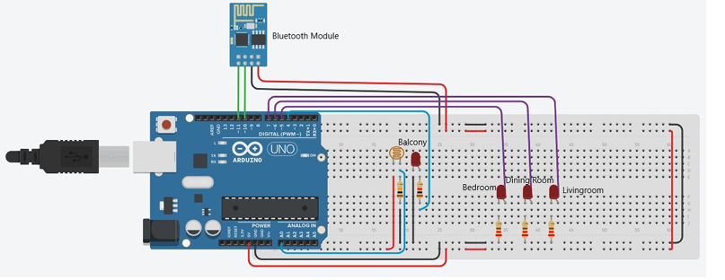
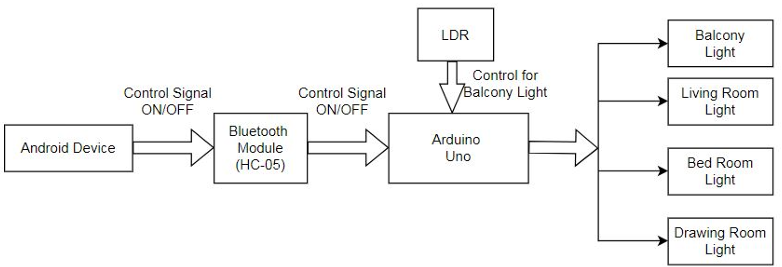
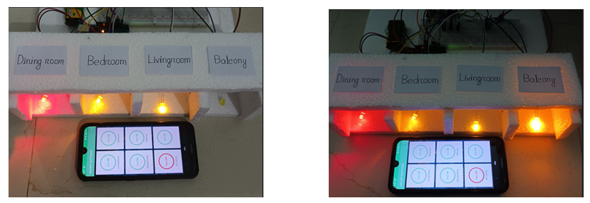

# Bluetooth-Controlled-Home-Lighting-System-Using-Arduino-UNO
This project implements a Bluetooth-controlled home lighting system using an Arduino Uno, HC-05 Bluetooth module, and LDR sensor. It allows remote control of lights via a smartphone and ensures energy efficiency by activating the balcony light only in low-light conditions.
## Objectives
- Control lights remotely via Bluetooth and a smartphone application.
- Program the balcony light to activate only when it’s dark outside.
- Establish an energy-saving lighting system.

## Components
- Arduino Uno
- HC-05 Bluetooth Module
- LDR (Light Dependent Resistor)
- LEDs (x4)
- Resistors (10k x1, 220 x3, 330 x1)
- Jumper wires
- 9V battery
- 8V battery

## Setup

### Circuit Diagram

*Figure 1: Circuit connection of the Bluetooth Controlled Home Lighting System*

### Block Diagram

*Figure 2: Block diagram of the Bluetooth Controlled Home Lighting System*

## Code
The Arduino code is included in the repository. It handles Bluetooth communication, light control, and LDR-based logic for the balcony light.
## Output Implemented Picture

*Figure 3: Working of the system, showing the implemented setup controlling lights via Bluetooth and LDR.*

## Results
The system successfully controls lights via a smartphone app, with the balcony light responding to ambient light conditions for energy efficiency.
